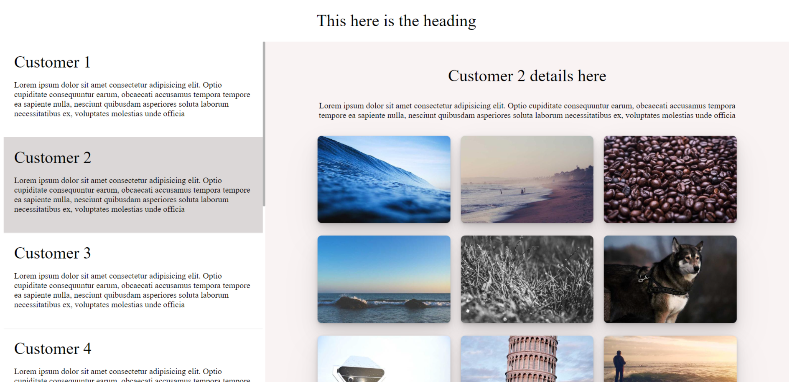

# Cube Project

This is a single-page web application built using React, TypeScript, and CSS. It displays a list of customers along with their details and allows us to view detailed information about each customer.

### [Deployed Link](https://cube-frontend-jutc.vercel.app/)

### [GitHub Repo Link](https://github.com/artisonii/cube_frontend)

## Features

- Displays a list of customers with their names and basic details.
- Allows us to click on a customer card to view detailed information about that customer.
- Utilizes React for building a dynamic user interface.
- Implements TypeScript for static typing and enhanced code readability.
- Styled using CSS for customizing the look and feel of the application.

## Tech Stack

- React
- CSS
- TypeScript

# Geting Started

1. To run the application locally, follow these steps:
2. Clone this repository to your local machine.
3. Navigate to the project directory.
4. Install dependencies using npm install or yarn install.
5. Start the development server using npm start or yarn start.
6. Open your browser and visit http://localhost:5173 to view the application.

## Screen shots

## Assinment Created by Arti Soni

- [LinkedIn](https://www.linkedin.com/in/arti-soni/)
- [Portfolio](https://artisonii.github.io/)
- [GitHub](https://github.com/artisonii)
